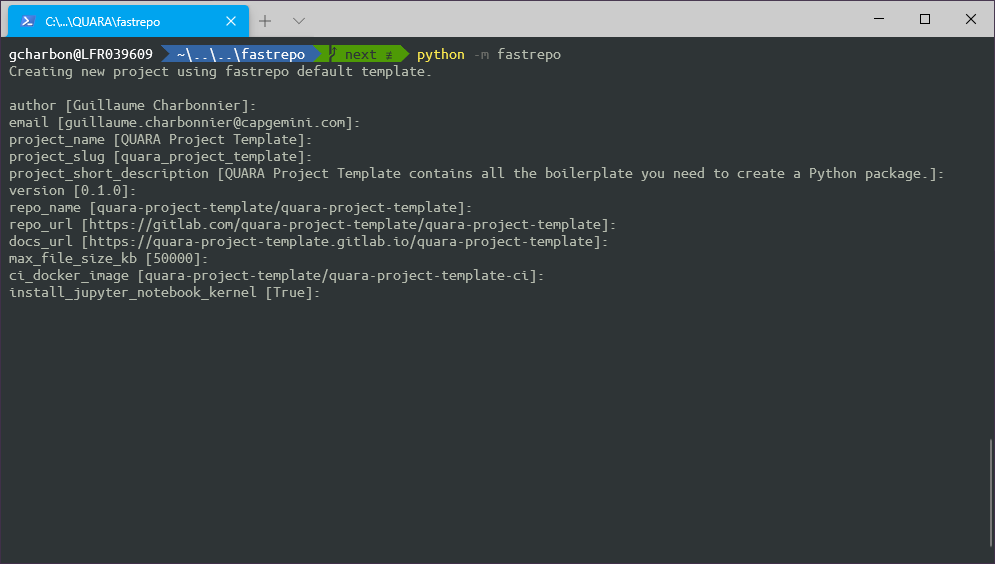

# Fastrepo


This documentation is still a work in progress, content might be updated at any moment.


This page is a F.A.Q. If you want to learn more about `fastrepo` and `python development`, check the links below:




## How to install _`fastrepo`_ ?

Install `fastrepo` as a user package using `pip`:

```bash
python -m pip install --user fastrepo
```

## How to create a new project?



```bash
python -m fastrepo
```



```
python -m fastrepo --template rest
```



```
python -m fastrepo --template nats
```



```
python -m fastrepo --template react-web
```



```
python -m fastrepo --template datascience
```



You will be then asked a series of questions which might vary depending of the project type:



## Where should I write code?

Once you answered all the questions, development dependencies will be installed and first commit will be performed.



When developing in python, all source code **must be** **located in** the `src/<package_name>` directory and must **contain** a file named \_\_init\_\_.py which **might be empty**.

You can add other files in this repository. Each file is a module. You can import any object \(functions, classes, ...\) from a module into another one.

Let's create a file named `client.py in the src/demo/directory:` 


```python
"""client module of the "demo" package."""

class Client:
    """A dummy class."""
    def make_request(self, *args, **kwargs):
        """A dummy method."""
        pass
```


Now let's create a file named `main.py` in the `src/demo/ directory`. You can import the `Client` class defined in the `client` module using a relative import:


```python
"""main module of the "demo" package."""
from .client import Client


def run():
    """"Run the program."""
    client = Client()
    client.make_request()
```





Check the tutorial [Building your f](http-services/building-your-first-api.md)irst API





Work in progress... Check the [roadmap](roadmap.md).





Work in progress... Check the [roadmap](roadmap.md).





Work in progress... Check the [roadmap](roadmap.md).




## Where should I write tests?



You can write unit tests in the `tests/` directory:


By default, you will find three files:

* `__init__.py`: This file must always be present in the `tests` directory and each of its children directories.
* `conftest.py: You can define` [`fixtures` ](https://docs.pytest.org/en/stable/fixture.html#scope-sharing-fixtures-across-classes-modules-packages-or-session)``in your `conftest` files or perform any test setup related stuff.``
* ```test_version.py`: This is a dummy test that check package version value.``




Check the tutorial [Testing your API](http-services/testing-your-api.md)





Work in progress... Check the [roadmap](roadmap.md). But you might want to take a loot at:

* [pytest fixtures](https://docs.pytest.org/en/stable/fixture.html#scope-sharing-fixtures-across-classes-modules-packages-or-session)
* [pytest parametrize](https://docs.pytest.org/en/stable/parametrize.html#pytest-mark-parametrize-parametrizing-test-functions)
* [monkeypatching with pytest](https://docs.pytest.org/en/3.1.1/monkeypatch.html#monkeypatching-mocking-modules-and-environments)





Work in progress... Check the [roadmap](roadmap.md). But you might want to take a look at:

* [React Testing Library Example](https://testing-library.com/docs/react-testing-library/example-intro)
* [React Testing Library Introduction](https://testing-library.com/docs/intro)
* [Jest DOM Custom Matcher](https://github.com/testing-library/jest-dom#custom-matchers)





Work in progress... Check the [roadmap](roadmap.md).




## How to add a dependency?



If you need to install an external package which your application depends on, you can install it using `poetry`:

```bash
poetry add <package_name>
```


If the package you want to install is a development dependency, use the `--dev` option.




If you need to install an external package which your application depends on, you can install it using `npm`:

```bash
npm i <package_name>
```


If the package you want to install is a development dependency, use the `--dev` option.




## How to add a development dependency?



If you need to install an external package which your application does not depend on directly but you still use during development, you can install it using `poetry`:

```bash
poetry add --dev <package_name>
```



If you need to install an external package which your application does not depend on directly but you still use during development, you can install it using `npm`:

```bash
npm i -D <package_name>
```



## How to run tests?



Use invoke which is installed as a development dependency to run your tests:

```bash
pydev test
```

> [`pytest` ](https://docs.pytest.org/en/stable/)is used to discover and run tests. [`pytest-cov`](https://pypi.org/project/pytest-cov/) is used to compute test coverage.



Use the `test` npm script to run your test:

```bash
npm run test
```



## How to format code?



Use the `format` invoke task to format your code:

```bash
pydev format
```

> [`black` ](https://github.com/psf/black)is used to format the code.



Use the `format` npm script to format your code:

```bash
npm run format
```

> [`eslint` ](https://eslint.org/)is used to format the code.



## How to lint code?



Use the `lint` invoke task to lint your code:

```bash
pydev lint
```

> [`flake8` ](https://flake8.pycqa.org/en/latest/)is used to lint the code.



Use the `lint` npm script to lint your code:

```bash
npm run lint
```

> [`prettier` ](https://prettier.io/)is used to format the code.



## How to type check code?



Use the `typecheck` invoke task to perform type checking:

```bash
pydev typecheck
```

> [`mypy` ](http://www.mypy-lang.org/)is used to perform type checking.




Typescrypt always performs type checking at build time.




## How to build the project?



Use the `build` invoke task to build the project:

```bash
pydev build
```


Note that this run the tests, capture coverage, and build the documentation **before** building the python package in`wheel` format.


Use the `--no-coverage` option to disable tests:

```bash
pydev build --no-coverage
```

Use the `--no-docs` option to disable the documentation build:

```bash
pydev build --no-docs
```

Use the --no-package option to disable the package build:

```bash
pydev build --no-package
```



Use the `build` npm script to build the project:

```bash
npm run build
```



## How to I publish the project?



Use the`publish` invoke task to publish the project to a package repository.

By default packages are published to pypi, but you can specify a specific repository to upload the package to using the `--repository`option:

```bash
pydev publish [--repository AZ_ARTIFACT_PACKAGE_FLOW_URL]
```




Work in progres... Check the [roadmap](roadmap.md).




## How to serve documentation?



Use the `docs` invoke task to serve the documentation on your localhost:

```bash
pydev docs
```


Documentation is powered by[`mkdocs` ](https://mkdocs.org)and [`mkdocs-material`](https://squidfunk.github.io/mkdocs-material/).





Work in progres... Check the [roadmap](roadmap.md).




